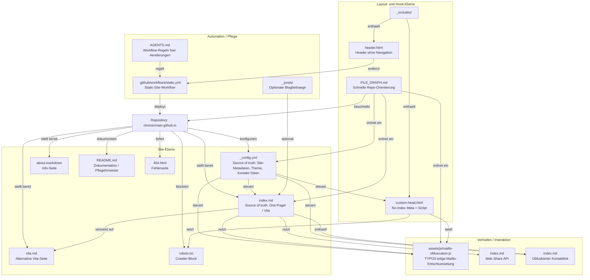

# File Graph

Semantische Uebersicht des Repositories fuer schnelle Orientierung, Source-of-Truth-Findung und kleinere, zielgerichtete Aenderungen.

## So liest man den Graphen

- Knoten mit `Source of truth` sind die primären Stellen fuer Aenderungen.
- Pfeile mit Verben zeigen die Beziehung, zum Beispiel `steuert`, `laedt`, `nutzt` oder `regelt`.
- Wenn du etwas aendern willst, startest du bei der Datei mit der hoechsten fachlichen Verantwortung.

## Typische Aenderungsgruppen

- Inhalt der Vita: [index.md](index.md) und bei Bedarf [vita.md](vita.md)
- Kontaktverhalten: [_config.yml](_config.yml), [index.md](index.md) und [assets/js/mailto-obfuscation.js](assets/js/mailto-obfuscation.js)
- Kopfbereich und Suchmaschinenverhalten: [_includes/custom-head.html](_includes/custom-head.html) und [robots.txt](robots.txt)
- Arbeitsregeln und Orientierung: [AGENTS.md](AGENTS.md) und [FILE_GRAPH.md](FILE_GRAPH.md)
