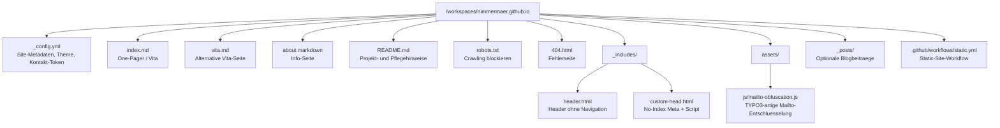

# File Graph

Kurzer Strukturueberblick fuer schnelle Orientierung im Repository.

## Kurz gelesen

- `index.md` ist die zentrale Seite.
- `AGENTS.md` definiert den bevorzugten Arbeits- und Commit-Workflow.
- `_includes/custom-head.html` und `assets/js/mailto-obfuscation.js` steuern No-Index und Kontakt-Obfuskation.
